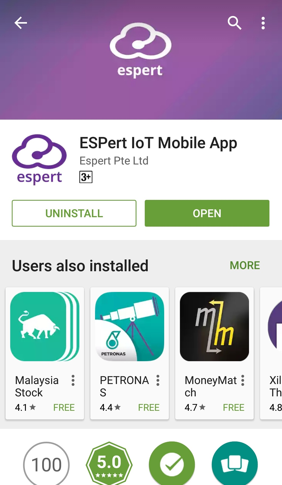

# ขั้นตอนการสมัครเข้าใช้งาน ESPert.io เพื่อแจ้งเตือนข้อความบนโทรศัพท์มือถือ

ESPert.io คืออะไร
ESPert.io คือ เว็บเซอร์วิซสำหรับส่งการแจ้งเตือนผ่านโทรศัพท์มือถือ หรือ Notification หากใครยังไม่ทราบว่า Notification คืออะไรนั้น เอาง่าย ๆ ก็เหมือนกับการแจ้งเตือนแชทของเฟสบุ๊ค หรือไลน์นั่นเอง เมื่อมีคนส่งข้อความเข้ามาก็จะส่งเสียง และข้อความแจ้งเตือนให้เราทราบ อีกทั้งยังส่ง Push Notification ผ่าน http GET ซึ่งง่ายต่อการใช้งานเหมาะสำหรับนักพัฒนา IoT โดย espert.io ถือเป็นอีกหนึ่งบริการที่น่าใช้ และนำไปต่อยอดใช้งานในด้านต่าง ๆ ได้อย่างมากมาย  โดยขั้นตอนการสมัครใช้งานมีดังต่อไปนี้

1. เข้าไปยังเว็บไซต์ espert.io จากนั้นคลิ๊กที่ Login
2. ลงทะเบียนเข้าใช้งานโดยคลิ๊กที่ปุ่ม Click here to register

3. ทำการกรอกข้อมูลพื้นฐานให้ครบทุกช่อง 
  

4. เมื่อกด Register จะแสดงหน้าจอให้ยืนยันในอีเมล์
  

5. ให้ทำการเข้าไปยืนยันในอีเมล์ที่เราได้สมัครเอาไว้
  

6. เมื่อยืนยันเรียบร้อยจะกลับมายังเว็บ espert.io เพื่อแสดงการยืนยันการสมัคร
  

7. ให้ทำการเข้าระบบด้วยการใส่ E-mail และ Password ที่เราได้สมัครเอาไว้
  

8. เมื่อเข้าระบบสำเร็จจะแสดงหน้าจอดังภาพด้านล่าง
  

9. แสดงหน้าเว็บพร้อมใช้งาน
  

10. จากนั้นให้ทำการดาวน์โหลด Application สำหรับโทรศัพท์มือถือ โดยสามารถดาวร์โหลดได้จาก play store สำหรับ android หรือ IOS สามารถดาวน์โหลดจากลิ้งนี้ก็ได้ [ลิ้งดาวน์โหลด App](http://www.thaigw.com/apps/espert/) \(ในที่นี้ขออนุญาตอธิบายวิธีการลงบนโทรศัพท์ android\)
  

11. ทำการติดตั้ง Application
  

12. เมื่อติดตั้งเสร็จให้เปิด Application ขึ้นมา
  

13. จะได้หน้าล็อคอินดังภาพด้านล่าง ให้เราทำการใส่ Email และ Password ที่ได้ทำการสมัครไว้เพื่อเข้าใช้งาน
  

14. เมื่อเข้าใช้งานได้แล้ว จะแสดงข้อความ Waiting for incoming message. เพื่อรอข้อความจากเว็บ espert.io
  

15. กลับมาที่เว็บ espert.io จะเห็นว่ามีอุปกรณ์เพิ่มเข้ามา ซึ่งก็คือโทรศัพท์ของเรานั่นเอง ต่อไปเราจะทดลองส่งข้อความเข้าโทรศัพท์กัน โดยให้คลิ๊กที่รูปสายฟ้าสีเขียวดังภาพด้านล่าง
  

16. ในหน้า Send Push Notification ก็จะมีช่องให้เราใส่ข้อความ และปุ่มกดส่ง อีกทั้งเรายังสามารถนำ Key หรือรหัสโทรศัพท์ของเราไปใช้งานได้อีกด้วย
  

17. เมื่อกด Send จะแสดงข้อความว่ามีการส่งข้อความสำเร็จ
  

18. ข้อความที่เราพิมพ์จากเว็บ espert.io ก็จะถูกส่งมายังโทรศัพท์มือถือของเราดังภาพด้านล่าง
  

