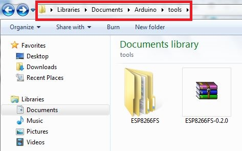
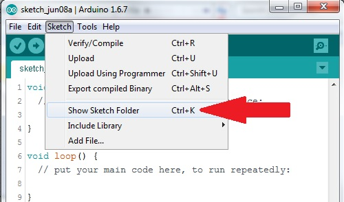

# File  System

## Table of Contents
  * [Uploading files to file system](#uploading-files-to-file-system)
  * [Flash layout](#flash-layout)

## การอัพโหลดไฟล์ขึ้น ESPresso Lite โดยใช้ ESP8266FS

*ESP8266FS* is a tool which integrates into the Arduino IDE. It adds a menu item to *Tools* menu for uploading the contents of sketch data directory into ESP8266 flash file system.

- ดาวน์โหลดเครื่องมืออัพโหลดไฟล์: https://github.com/esp8266/arduino-esp8266fs-plugin/releases/download/0.2.0/ESP8266FS-0.2.0.zip.
- แตกไฟล์เข้าไปที่โฟล์เดอร์ `<home_dir>Documents/Arduino/tools/ESP8266FS/tool/esp8266fs.jar`

- Restart Arduino IDE
- เปิดหรือสร้าง Arduino Sketch ขึ้นมา และเข้าไปโปรเจ็ค (เลือกเมนู Sketch > Show Sketch Folder) 

- สร้างโฟล์เดอร์ `data` ขึ้นมา และเอาไฟล์ที่ต้องการอัพโหลดเข้าไปใน ESPresso Lite วางไว้ใน `data`
- เลือกบอร์ดให้ถูกต้อง และปิด Serial Monitors
- เลือกเมนู Tools > ESP8266 Sketch Data Upload. เมื่ออัพโหลดเสร็จแล้วจะขึ้นว่า  `SPIFFS Image Uploaded`

    #include <Arduino.h>
    #include <ESP8266WiFi.h>
    #include <ESP8266WebServer.h>
    #include "FS.h"

    #define WIFI_SSID "ESPERT-002"
    #define WIFI_PASS "espertap"

    ESP8266WebServer server(80);

    void init_hardware();
    void init_fs();
    void init_webserver();
    void init_wifi();

    void setup() {
      init_hardware();
      init_wifi();
      init_fs();
      init_webserver();
    }

    void loop() {
      server.handleClient();
    }

    void init_hardware()
    {
      Serial.begin(115200);
      delay(10);
      Serial.println();
      Serial.println("Serial port initialized.");
      pinMode(LED_BUILTIN, OUTPUT);
    }

    void init_fs() {
      Serial.println("Mounting FS...");
      if (!SPIFFS.begin()) {
        Serial.println("Failed to mount file system");
        return;
      }
      Serial.println("FS mounted.");

      Serial.println("CMMC READING ROOT DIRECTORY..");
      Dir root = SPIFFS.openDir("/");

      while (root.next()) {
        String fileName = root.fileName();
        File f = root.openFile("r");
        Serial.printf("%s: %d\r\n", fileName.c_str(), f.size());
      }
    }

    void init_webserver() {
      server.serveStatic("/", SPIFFS, "/");
      server.begin();
    }

    void init_wifi() {
      char textID[30] = {'\0'};
      sprintf(textID, "ESPresso-%lu", ESP.getChipId());

      WiFi.disconnect();
      WiFi.mode(WIFI_AP_STA);
      WiFi.softAP(textID);
      delay(200);

      IPAddress myIP = WiFi.softAPIP();
      Serial.printf("AP(%s) IP address: ", textID);
      Serial.println(myIP);
      //WiFi.begin(WIFI_SSID, WIFI_PASS);
    }

